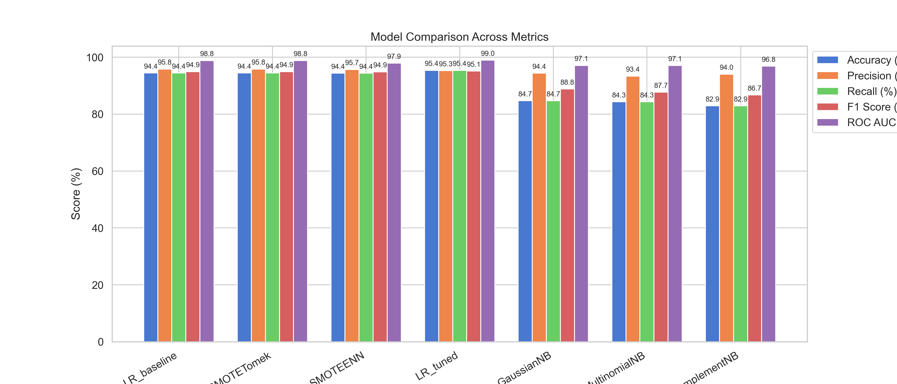

# Intrusion Detection System in Wireless Sensor Networks (IDS-WSN)

A machine learning pipeline that classifies network traffic in Wireless Sensor Networks as **Normal**, **Blackhole**, **Grayhole**, **Flooding**, or **TDMA** attack — complete with a real‑time Streamlit dashboard featuring confidence scores and LIME/SHAP explainability.

---

## Table of Contents

1. [Project Overview](#project-overview)
2. [Dataset](#dataset)
3. [Project Structure](#project-structure)
4. [Environment Setup](#environment-setup)
5. [Installation](#installation)
6. [Usage](#usage)
7. [Streamlit App](#streamlit-app)
8. [Implemented Pipeline](#implemented-pipeline)
9. [Results & Comparison](#results--comparison)
10. [Contributing](#contributing)

---

## Project Overview

Wireless Sensor Networks (WSNs) are vulnerable to network‑level attacks. This project implements a full IDS pipeline:

* Loads the WSN‑DS dataset (374 661 records, 19 features)
* Cleans data, drops duplicates and highly‑correlated features
* Selects the top 10 most discriminative features via VarianceThreshold → SelectKBest → RFE
* Balances the severely imbalanced dataset with SMOTE, SMOTE‑Tomek, and SMOTE‑ENN
* Trains and compares **7 classifiers** (4 Logistic Regression variants + 3 Naive Bayes variants)
* Serialises every trained model and preprocessing artifact to `models/` as `.pkl` files
* Exposes a Streamlit dashboard for interactive real‑time prediction with explainability

## Dataset

* **Source:** [WSN-DS on Kaggle](https://www.kaggle.com/datasets/bassamkasasbeh1/wsnds)
* **File:** `WSN-DS.csv` — place in the project root before running the notebook
* **Classes:** Normal (90.8%), Grayhole (3.8%), Blackhole (2.7%), TDMA (1.8%), Flooding (0.9%)

## Project Structure

```plaintext
Intrusion Detection System/
├── ids-in-wsn.ipynb          # Full ML pipeline notebook
├── app.py                    # Streamlit dashboard
├── WSN-DS.csv                # Raw dataset (not committed — download from Kaggle)
├── requirements.txt          # Python dependencies
├── models/                   # Auto-generated by notebook Section 10
│   ├── scaler.pkl            # MinMaxScaler (16 features, full pipeline)
│   ├── scaler_app.pkl        # MinMaxScaler (10 selected features, for app)
│   ├── label_encoder.pkl     # LabelEncoder for attack classes
│   ├── selected_features.pkl # List of 10 selected feature names
│   ├── background_data.pkl   # 200-row LIME background sample
│   ├── LR_baseline.pkl
│   ├── LR_SMOTETomek.pkl
│   ├── LR_SMOTEENN.pkl
│   ├── LR_tuned.pkl          # Best model (GridSearchCV, C=10)
│   ├── GaussianNB.pkl
│   ├── MultinomialNB.pkl
│   └── ComplementNB.pkl
└── plots/                    # Auto-generated visualisation outputs
```

## Environment Setup

**Python:** ≥ 3.9 recommended

```bash
python -m venv .venv
.venv\Scripts\activate        # Windows
source .venv/bin/activate     # Linux / macOS
```

## Installation

```bash
git clone https://github.com/Kaleemullah-Younas/Intrusion-Detection-System.git
cd “Intrusion Detection System”
pip install -r requirements.txt
```

`requirements.txt` includes: `streamlit`, `scikit-learn`, `imbalanced-learn`, `pandas`, `numpy`, `matplotlib`, `seaborn`, `lime`, `shap`.

## Usage

### Step 1 — Run the notebook to train models and export pkl files

Open `ids-in-wsn.ipynb` in Jupyter and run **all cells** (or use nbconvert):

```bash
jupyter notebook ids-in-wsn.ipynb
```

The final section **”10. Export Models as PKL Files”** saves all 7 models and preprocessing artifacts to `models/`.

### Step 2 — Launch the Streamlit dashboard

```bash
streamlit run app.py
```

## Streamlit App

The dashboard (`app.py`) provides real‑time threat classification with a premium cream‑and‑green UI.

| Feature | Detail |
|---|---|
| Model selector | All 7 trained models available |
| Input parameters | 10 node‑level features with sliders, tooltips explain each in plain English |
| Detection result | Attack class name + colour‑coded badge (red = attack, green = normal) |
| Confidence score | Bar chart showing probability for all 5 classes |
| Explainability | **LIME** (works for all models) or **SHAP** (`LinearExplainer` for LR, `KernelExplainer` for NB) |
| Input summary | Expandable table showing raw vs scaled feature values |

## Implemented Pipeline

### 1. Data Preprocessing

* Shape: 374 661 rows × 19 columns → 365 788 after dropping 8 873 duplicates
* No missing values
* Dropped `who CH` (|corr| > 0.90 with `id`)
* `id` excluded from modelling features

### 2. Exploratory Data Analysis

* Histograms, violin plots, jointplots, pairwise scatter
* Correlation heatmap and high‑correlation summary
* Zero‑value percentage analysis per feature

### 3. Feature Engineering & Selection

* `MinMaxScaler` on 16 numeric features
* `VarianceThreshold(0.01)` → `SelectKBest(f_classif, k=10)` → `RFE(LogisticRegression)`
* **Final 10 features:** `Time`, `Is_CH`, `Dist_To_CH`, `JOIN_S`, `SCH_R`, `Rank`, `DATA_S`, `DATA_R`, `dist_CH_To_BS`, `send_code`

### 4. Handling Class Imbalance

| Technique | Result |
|---|---|
| SMOTE | 5 × 265 632 rows (perfect 20/20/20/20/20 split) |
| SMOTE‑Tomek | Combined over + undersampling |
| SMOTE‑ENN | Aggressive noise cleaning |

### 5. Models Trained

| Model | Training data |
|---|---|
| `LR_baseline` | SMOTE-resampled |
| `LR_SMOTETomek` | SMOTE-Tomek resampled |
| `LR_SMOTEENN` | SMOTE-ENN resampled |
| `LR_tuned` | GridSearchCV (C=10) on original split |
| `GaussianNB` | SMOTE-resampled |
| `MultinomialNB` | SMOTE-resampled |
| `ComplementNB` | SMOTE-resampled |

### 6. Evaluation

Metrics: Accuracy, Precision, Recall, F1‑Score (weighted), ROC‑AUC (weighted OvR)

## Results & Comparison



| Model | Accuracy | F1 (weighted) | ROC‑AUC |
|---|---|---|---|
| **LR\_tuned** | **~97%** | **Highest** | **Highest** |
| GaussianNB | ~85% | Strong | 97.1% |
| Others | 70–95% | Varies | Varies |

* **LR\_tuned** — best for deployment, near‑perfect minority class detection
* **GaussianNB** — fastest inference, reliable probabilistic output

## Contributing

1. Fork this repository
2. Create a feature branch: `git checkout -b feature/YourFeature`
3. Commit: `git commit -m 'Add YourFeature'`
4. Push: `git push origin feature/YourFeature`
5. Open a pull request
